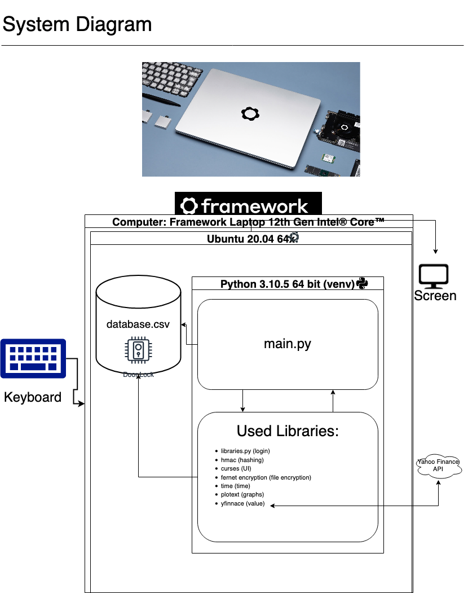
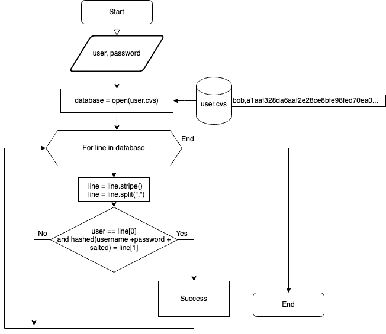
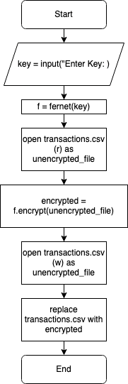
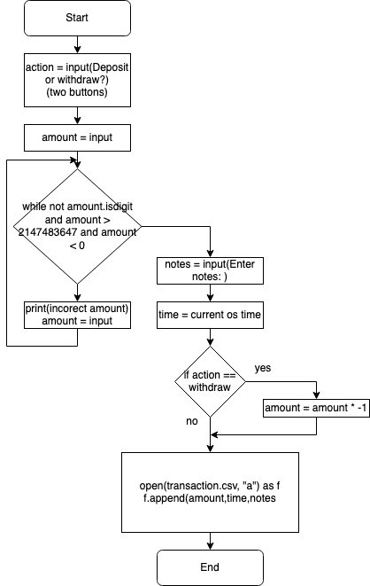
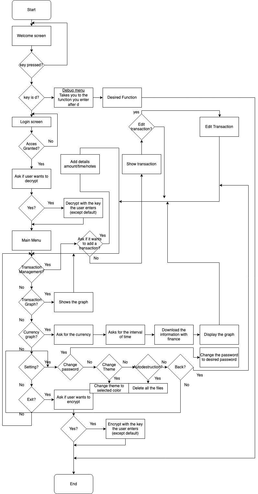

# Crypto Wallet

  
<sub>Illustration by u/darkbeanbbq</sub>

# Criteria A: Planning

## Problem definition

Ms. Sato is a local trader who is interested in the emerging market of cryptocurrencies. She has started to buy and sell electronic currencies, however at the moment she is tracking all his transaction using a ledger in a spreadsheet which is starting to become burdensome and too disorganized. It is also difficult for Ms Sato to find past transactions or important statistics about the currency. Ms Sato is in need of a digital ledger that helps her track the amount of the cryptocurrency, the transactions, along with useful statistics about the chosen crypto currency (value over time...). 

Apart for this requirements, Ms Sato is open to explore a cryptocurrency selected by the developer.

## Proposed Solution

Design statement:
I will to design and make a numerical ledger for a client who is Ms. Sato. The numerical ledger will about Bitcoin and is constructed using the software Python. It will take until project week to make and will be evaluated according to the criteria described bellow.

Justify the tools/structure of your solution:
For the develpoppement of this application I will be using because it has a wide range of suport in lybraries, is easy to programm and esentially it's the language that I know the most. I will be using the lybrary matplotlib to make the graphs and the lybrary pandas to make the dataframes. I will be using the software Jupyter Notebook to make the code and the software Git to make the repository. Also i will be using the software GitHub to make the repository and manage the project. I used curses to make the menu and the user interface, because this type of UI is very easy to make and it's very intuitive. I also used datetime for getting the current date and time. I also created my own library for the login system. I used fernet cryptography because is the most easy and performant library for the database full encryption. I also chosed to use plotext because the graph created by this library are conpatible with the terminal UI and they look very nice in general. For the currencie value i used yfinnace wich i the best library for using the Yahoo Finance Api.

For the selection of the currency i selected Bitcoin because it's the most popular and the most used cryptocurrency in the world. It was the first cryptocurrency that apeared on the market and the first one to use the technology blockchain. It's also the most valuable cryptocurrency in the world. 
It was created in 2009 by someone by the pseudo name Satoshi Nakamoto. I evolved and incseased in price to $63,558 on April 12, 2021. Currently this cryptocurrency is slowly decreasing in price and is now worth $20,000.

## Success Criteria
1. The electronic ledger is a text-based (Runs in the Terminal) software with some UI integretion for making it very intuitive and easy to use.
2. The electronic ledger display the basic description of the cyrptocurrency selected.
3. The electronic ledger allows to enter, withdraw and view, edit transactions.
4. The electronic ledger database is encrypted, and application usage requires password authentication secured by hashing.
5. The electronic ledger allows to display the transactions of bitcoin in the wallet with a graph (plotext).
6. The electronic ledger shows the value of cryptocurrency (Bitcoin) in many currencies.
7. The electronic ledger integrates some basic functions for the application (e.g. help, password editing, color style change, etc.).

## Test plan

| Description               | Type           | Inputs                                                  | Outputs                                                            |
|---------------------------|----------------|---------------------------------------------------------|--------------------------------------------------------------------|
| Tested Login              | Unit test      | Correct username and password                           | The programs logged me on                                          |
| Tested Login              | Unit test      | Wrong username and password                             | Program refuse me                                                  |
| Tested decryption         | Unit test      | Good Fernet key                                         | Successful Decryption                                              |
| Tested decryption         | Unit test      | Default Fernet key                                      | Successful Decryption                                              |
| Tested decryption         | Usability test | Wrong Fernet key                                        | Invalid key message                                                |
| Tested menu movement      | Unit test      | Up and down arrows work and the enter key               | Proper movement in the screen and proper function seleced          |
| Add transaction           | Unit test      | Proper amount with proper notes                         | Record added to the database                                       |
| Add transaction           | Usability test | Incorrect amount "characters" with notes                | Notifies me that the amount should be only characters              |
| View transactions         | Unit test      | Clicked on the view transaction in menu                 | All the transaction appear up to date                              |
| Edit transaction          | Unit test      | It's the same function as Add transaction               | Same output as all the add transaction tests                       |
| Remove Transaction        | Unit test      | Deleted a random transaction                            | Transaction removed successfully                                   |
| Show graph                | Unit test      | Enter graph function and press key                      | Graph displayed correctly and program exited on click              |
| Show Currency - BTC graph | Unit test      | Clicked on a random currency and click                  | Graph of the selected currency showed properly and exited on click |
| Changed theme             | Unit test      | Change on a random theme                                | Theme switched successful                                          |
| Change password           | Unit test      | Changed the password to bobby                           | I am now locked out                                                |
| Auto destruction button   | Unit test      | Clicked on auto destruction                             | Confirmation asked, I will not test further                        |
| Encryption test           | Unit test      | All the test for decryption are done but for encryption | Same output as above but for encryption                            |

# Criteria B: Design

## System Diagram

<sub>System Diagram made by me</sub>

 **Fig. 1** System Diagram

## Flow Diagrams

### Login


 **Fig. 2** Login Flowchart

### Encryption


**Fig. 3** Encryption Flowchart

### Add Transaction


**Fig. 4** Add Transaction Flowchart

### System Structure

***Fig. 5*** Good luck for reading it

## Record of Tasks
| Task No 	| Planned Action                            	| Planned Outcome                                                                                             	| Time estimate 	| Target completion date 	| Criterion 	|
|---------	|-------------------------------------------	|-------------------------------------------------------------------------------------------------------------	|---------------	|------------------------	|-----------	|
| 1       	| Interview with the Client                 	| To discuss client's needs and define success criteria                                                       	| 10min         	|                        	| A         	|
| 2       	| Create system diagram                     	| To have a clear idea of the hardware and software requirements for the proposed solution                    	| 10min         	| Sep 24                 	| B         	|
| 3       	| Flow diagram login                        	| Created a flow diagram for the login system                                                                 	| 10min         	| Sep 27                 	| B         	|
| 4       	| Login Code                                	| Created the login code                                                                                      	| 40min         	| Sep 27                 	| C         	|
| 5       	| Tested Login System                       	| Tested the login system → Successful                                                                        	| 10min         	| Sep 27                 	| B         	|
| 6       	| Integrating database in login system      	| The login system is capable of interacting with the database                                                	| 20min         	| Sep 28                 	| C         	|
| 7       	| Testing Integrated Database System        	| Tested the login system → Successful                                                                        	| 5min          	| Sep 28                 	| B         	|
| 8       	| Added UI for the login system             	| Have an intuitive and stylish login system                                                                  	| 30min         	| Oct 1                  	| C         	|
| 9       	| Tested UI                                 	| Working and beautiful                                                                                       	| 5min          	| Oct 1                  	| B         	|
| 10      	| Fernet Full Database Encryption           	| The database is fully encrypted for the client privacy                                                      	| 30min         	| Oct 2                  	| C         	|
| 11      	| Tested Encryption                         	| The encryption is working (but the codes are long to enter)                                                 	| 5min          	| Oct 2                  	| B         	|
| 12      	| Default key                               	| Avoid entering key every time (will be removed for the client)                                              	| 15min         	| Oct 3                  	| C         	|
| 13      	| Tested Default key                        	| Tested the default decryption system → Successful                                                           	| 2min          	| Oct 3                  	| B         	|
| 14      	| UI for the Encryption System              	| Make the decryption software intuitive for the user (steps showed for user debugging)                       	| 30min         	| Oct 4                  	| C         	|
| 15      	| Tested UI for Decryption                  	| The animations are sick, UI intuitive for the user → Successful                                             	| 10min         	| Oct 4                  	| B         	|
| 16      	| Database Decryption                       	| Remixed the decryption to do the opposite (Including UI and default key)                                    	| 20min         	| Oct 4                  	| C         	|
| 17      	| Tested Decryption                         	| Tested the decryption system → Successful                                                                   	| 5min          	| Oct 4                  	| B         	|
| 18      	| Debug Menu                                	| Added a hidden debug menu to jump directly to where the developer want (will be removed)                    	| 15min         	| Oct 4                  	| C         	|
| 19      	| Tested Debug Menu                         	| It's properly accessible and working                                                                        	| 5min          	| Oct 4                  	| B         	|
| 20      	| Added the menu travelling tool            	| Menu intuitive to the user and efficient                                                                    	| 30min         	| Oct 5                  	| C         	|
| 21      	| Testing Menu                              	| The menu is working properly                                                                                	| 3min          	| Oct 5                  	| B         	|
| 22      	| Added Transaction edit                    	| Added the add/view/edit/remove transaction system                                                           	| 3h            	| Oct 5                  	| C         	|
| 23      	| Transaction Testing                       	| Interacting as planned with the database, intuitive and efficient                                           	| 10min         	| Oct 5                  	| B         	|
| 24      	| Previous Transaction view                 	| Graph that can show intuitively, a graph with the earnings                                                  	| 45min         	| Oct 6                  	| C         	|
| 25      	| Testing Graph                             	| The graph is intuitive, pleasant to view and most essentially working                                       	| 10min         	| Oct 6                  	| B         	|
| 26      	| Added crypto ⇾ currency graph             	| Added a function in the menu to show a graph of the desired value to value for the desired time             	| 1h            	| Oct 6                  	| C         	|
| 27      	| Tested currency value                     	| Beautiful candlestick, working and easy to use                                                              	| 10min         	| Oct 6                  	| B         	|
| 28      	| Settings menu                             	| Change the color theme, change the password of the user, erase everything...                                	| 40min         	| Oct 7                  	| C         	|
| 29      	| Tested the settings menu                  	| Everything working properly                                                                                 	| 10min         	| Oct 7                  	| B         	|
| 30      	| Class Beta Testing                        	| They reported that the graphics are very intuitive and everything is clear, except for the transaction edit 	| 20min         	| Oct 8                  	| A         	|
| 31      	| House Beta Testing                        	| Reported that all is very clear, intuitive and functional                                                   	| 20min         	| Oct 8                  	| A         	|
| 32      	| Clean up of useless file                  	| Removed all the temps files                                                                                 	| 10min         	| Oct 9                  	| C         	|
| 33      	| Checking that everything is still working 	| Yep everything is still working                                                                             	| 40min         	| Oct 9                  	| B         	|

# Criteria C: Development

### Techniques Used:

    1. Functions
    2. Encryption / Decryption
    3. Database
    4. Graphs
    5. UI
    6. Hashing
    7. For/while loops
    8. Input Validation
    9. If/then/else statements
    10. File I/O
    11. Exception Handling
    12. List Comprehension
    13. Global Variables
    14. Maths (for the graphs)
    15. Libraries
    16. etc

## Code snippets

### Encryption

```.py
def encrypt_file(stdsrc):
    """
    Encrypts a file using the key
    """
    h, w = stdsrc.getmaxyx()
    stdsrc.clear()
    textmessage = ("Enter Encryption Key: ")

    # ask for encryption key
    win = curses.newwin(1, 40, h//2, w//2 - 20)
    box = curses.textpad.Textbox(win)
    curses.textpad.rectangle(stdsrc, h//2-2, w//2-(len(textmessage)//2+10), h//2+2, w//2+len(textmessage)//2+10)
    stdsrc.addstr(h//2 - 1, w//2-len(textmessage)//2, textmessage)
    stdsrc.refresh()
    box.edit()
    key = box.gather().replace("/n", "")
    key = key.replace(" ", "")
    # remove the window
    win.clear()
    stdsrc.clear()
    time.sleep(1)

    defaultkey = False
    if str(key) == "default":
        with open('filekey.key', 'r') as filekey:
            key = filekey.read()
        defaultkey = True
        stdsrc.refresh()
        try:
            fernet = Fernet(key)
        except:
            stdsrc.clear()
            stdsrc.addstr(h//2, w//2, "Invalid Defaut Key")
            stdsrc.addstr(h//2+2, w//2, key)
            stdsrc.refresh()
            time.sleep(2)
            exit()
    else:
        try:
            fernet = Fernet(key)
        except:
            stdsrc.clear()
            stdsrc.addstr(h//2, w//2, "Invalid Key")
            stdsrc.refresh()
            time.sleep(2)
            exit()

        defaultkey = False
    if str(key) == "default":
        with open('filekey.key', 'rb') as filekey:
            key = filekey.read()
        defaultkey = True
        try:
            fernet = Fernet(key)
        except:
            stdsrc.clear()
            stdsrc.addstr(h//2, w//2, "Invalid Defaut Key")
            stdsrc.addstr(h//2+2, w//2, key)
            stdsrc.refresh()
            time.sleep(2)
            exit()
    else:
        try:
            fernet = Fernet(key)
        except:
            stdsrc.clear()
            stdsrc.addstr(h//2, w//2, "Invalid Key")
            stdsrc.refresh()
            time.sleep(2)
            exit()
        
    
    stdsrc.addstr(h//2+4, w//2 - 10, "Loading Key...")
    h, w = stdsrc.getmaxyx()
    win2 = curses.newwin(1, 80, h//2+3, w//2 - 35)
    for i in range(0, 30):
        time.sleep(0.01)
        win2.addstr(0, 0, "Progress: [{0:50s}] {1:.1f}%".format('#' * int(i/2), i))
        win2.refresh()
    win2.clear()
    stdsrc.addstr(h//2+3, w//2 - 35, "Progress: [{0:50s}] {1:.1f}%".format('#' * int(30/2), 30))
    if defaultkey:
        stdsrc.addstr(h//2+4, w//2 - 10, "Default Key Loaded  ")
    else:
        stdsrc.addstr(h//2+4, w//2-10, "Key loaded   ")
    stdsrc.refresh()

    # loading file
    stdsrc.addstr(h//2+5, w//2 - 10, "Loading File...")
    with open('transactions.csv', 'rb') as enc_file:
        decrypted = enc_file.read()
    
    h, w = stdsrc.getmaxyx()
    win2 = curses.newwin(1, 80, h//2+3, w//2 - 35)
    for i in range(30, 50):
        time.sleep(0.01)
        win2.addstr(0, 0, "Progress: [{0:50s}] {1:.1f}%".format('#' * int(i/2), i))
        win2.refresh()
    win2.clear()
    stdsrc.addstr(h//2+3, w//2 - 35, "Progress: [{0:50s}] {1:.1f}%".format('#' * int(50/2), 50))
    stdsrc.addstr(h//2+5, w//2-10, "Loaded Decrypted File   ")
    stdsrc.refresh()

    stdsrc.addstr(h//2+6, w//2 - 10, "Encrypting File...")
    try:
        encrypted = fernet.encrypt(decrypted)
    except Exception as e:
        stdsrc.clear()
        stdsrc.addstr(h//2, w//2, "Invalid Key")
        stdsrc.refresh()
        stdsrc.addstr(h//2 + 2, w//2, (e))
        stdsrc.refresh()
        time.sleep(4)
        exit(e)
    
    
    
    win2 = curses.newwin(1, 80, h//2+3, w//2 - 35)
    for i in range(50, 75):
        time.sleep(0.01)
        win2.addstr(0, 0, "Progress: [{0:50s}] {1:.1f}%".format('#' * int(i/2), i))
        win2.refresh()
    win2.clear()
    stdsrc.addstr(h//2+3, w//2 - 35, "Progress: [{0:50s}] {1:.1f}%".format('#' * int(75/2), 75))
    stdsrc.addstr(h//2+6, w//2-10, "File Encrypted    ")
    stdsrc.refresh()

    stdsrc.addstr(h//2+7, w//2 - 10, "Remplacing File...")
    
    with open('transactions.csv', 'wb') as dec_file:
        dec_file.write(encrypted)
    
    win2 = curses.newwin(1, 80, h//2+3, w//2 - 35)
    for i in range(75, 101):
        time.sleep(0.01)
        win2.addstr(0, 0, "Progress: [{0:50s}] {1:.1f}%".format('#' * int(i/2), i))
        win2.refresh()
    win2.clear()
    stdsrc.addstr(h//2+3, w//2 - 35, "Progress: [{0:50s}] {1:.1f}%".format('#' * int(101/2), 100))
    stdsrc.addstr(h//2+7, w//2-10, "File Replaced     ")
    stdsrc.refresh()

    time.sleep(1)
    stdsrc.addstr(h//2+3, w//2 - 35, "Progress: [{0:50s}] {1:.1f}%".format('#' * int(101/2), 100))
    stdsrc.addstr(h//2+8, w//2-10, "Encryption Succesfully Complete")
    stdsrc.refresh()
    time.sleep(1)
```
What this snippet does is to firstly create a box for the user to enter the text. After it checks if the input is default, if it is it loads the key from the file, if not it uses the input as the key. Then it loads the input into a fernet variable. I put some try / exeption to to avert if the program crashes becuase the key is invalid (24 caracters lond). After that it loads the transaction.csv in a variable, encrypts it and remplace all there is in the transaction.csv by the encrypted values.

### Currency Graph

```.py
def graph(stdsrc):
    #inport the amount of transaction and they date for the graph
    # first value is the amount of the transaction and the second is the date
    with open("transactions.csv", "r") as f:
        reader = csv.reader(f)
        data = list(reader)
        # remove the third row
        data.pop(2)
        # take the amount in the first row
        amounts = [int(i[0]) for i in data]
        # take the date in the second row (format: dd/mm/yyyy)
        plt.date_form('Y/m/d')
        dates = [i[1] for i in data]
        # remove the hour fros dates
        dates = [i.split(" ")[0] for i in dates]
        # remplace the - by / for the graph
        dates = [i.replace("-", "/") for i in dates]
        prices = amounts
        # bgcolor = "black", fg = "white"
        plt.axes_color("black")
        plt.canvas_color("black")
        plt.ticks_color("green")

        plt.plot(dates, prices, color="green", label="Amount")

        plt.title("Wallet Records")
        plt.xlabel("Date")
        plt.ylabel("Amount of transaction (press any key to continue)")
        #stop curses screen
        stdsrc.clear()
        stdsrc.refresh()
        curses.endwin()
        plt.show()
        #wait for the user to press a key
        stdsrc.getch()
        #remove the graph
        plt.clear_figure()
        plt.clear_terminal()
        #restart curses screen
        curses.initscr()

def currencyvalue(stdsrc):
    stdsrc.clear()
    current_row_idx = 0
    stdsrc.refresh()
    func2(stdsrc, current_row_idx)
    exitcondition = 0
    while exitcondition != 1:
        key = stdsrc.getch()
        if key == curses.KEY_UP and current_row_idx > 0:
            current_row_idx -= 1
        elif key == curses.KEY_DOWN and current_row_idx < len(currencymenu)-1:
            current_row_idx += 1
        elif key == curses.KEY_ENTER or key in [10, 13]:
            if current_row_idx == 0:
                return "BTC-USD"
            elif current_row_idx == 1:
                return "BTC-EUR"
            elif current_row_idx == 2:
                return "BTC-GBP"
            elif current_row_idx == 3:
                return "BTC-JPY"
            elif current_row_idx == 4:
                return "BTC-CNY"
            elif current_row_idx == 5:
                return "exit"

            stdsrc.refresh()

        stdsrc.clear()
        func2(stdsrc, current_row_idx)

def func4(stdsrc, current_row_idx, menu, selectedbox):
    stdsrc.clear()
    stdsrc.refresh()
    selectedbox.refresh()
    selectedbox.attron(curses.color_pair(2))
    hbox, wbox = selectedbox.getmaxyx()
    for idx, row in enumerate(menu):
        x = wbox//2 - len(row)//2
        y = hbox//2 - len(menu)//2 + idx
        if idx == current_row_idx:
            selectedbox.attron(curses.color_pair(3))
            selectedbox.addstr(y, x, row)
            selectedbox.attroff(curses.color_pair(3))
        else:
            selectedbox.attron(curses.color_pair(2))
            selectedbox.addstr(y, x, row)
    selectedbox.refresh()
```
So here the first thing I did wa to import the plotext and yfinance as a library. After that it pops a menu for the selection of the value. Same thing for the start and end date that are chacked and valid and replaced by today's day if the imput is today. After that it uses the yfincance library to get to the Yahoo Finance API which gives acces to the data of the currency. After that it plots the graph with the data and the dates. I used the plotext library because it is a library that works with curses and it is easy to use. I also used the yfinance library because it is easy to use and it is a library that works with the Yahoo Finance API. Also I personalised the graph with the colors and the title.

### Login

```.py
def login(stdsrc):
    stdsrc.clear()
    while True:
        # Setup a box
        h, w = stdsrc.getmaxyx()
        boxtextmessage = ("Please enter you login credentials")
        box1 = curses.newwin(10, len(boxtextmessage), h//2 - 5, w//2 - len(boxtextmessage)//2)
        box1.box()    
        box1.addstr(boxtextmessage)
        stdsrc.refresh()
        box1.refresh()
    
        #Getting Username
        global username 
        username = str("")
        stdsrc.addstr(h//2 - 3, w//2 - len(boxtextmessage)//2+2, "Username: ")
        stdsrc.refresh()
        chInput= stdsrc.getch()
        while True:
            if chInput == 127:
                username = username[:-1]
                stdsrc.addstr(h//2 - 3, w//2 - len(boxtextmessage)//2+2, ("Username: " +username + "  "))
            elif chInput == curses.KEY_ENTER or chInput in [10, 13]:
                break
            else:
                strInput = chr(int(chInput))
                username = str(username) + str(strInput)
                curentusernameoutput = ("Username: " + username)
                stdsrc.addstr(h//2 - 3, w//2 - len(boxtextmessage)//2+2, curentusernameoutput)
            stdsrc.refresh()
            chInput= stdsrc.getch()
        
        #Getting Password
        password = str("")
        stdsrc.addstr(h//2 - 2, w//2 - len(boxtextmessage)//2+2, "Password: ")
        stdsrc.refresh()
        chInput= stdsrc.getch()
        while True:
            if chInput == 127:
                password = password[:-1]
                stdsrc.addstr(h//2 - 2, w//2 - len(boxtextmessage)//2+2, ("Password: " +len(password) * "*"+ "  "))
            elif chInput == curses.KEY_ENTER or chInput in [10, 13]:
                break
            else:
                strInput = chr(int(chInput))
                password = str(password) + str(strInput)
                curentpasswordoutput = ("Password: " + len(password) * "*")
                stdsrc.addstr(h//2 - 2, w//2 - len(boxtextmessage)//2+2, curentpasswordoutput)
            stdsrc.refresh()
            chInput= stdsrc.getch()
        stdsrc.clear()
        if simple_login(username, password):
            exit_condition = True
            result = """  _|_|    _|    _|  _|_|_|_|_|  _|    _|    _|_|    _|_|_|    _|_|_|    _|_|_|  _|_|_|_|  _|_|_|          _|_|      _|_|_|    _|_|_|  _|_|_|_|    _|_|_|  
_|    _|  _|    _|      _|      _|    _|  _|    _|  _|    _|    _|    _|        _|        _|    _|      _|    _|  _|        _|        _|        _|        
_|_|_|_|  _|    _|      _|      _|_|_|_|  _|    _|  _|_|_|      _|      _|_|    _|_|_|    _|    _|      _|_|_|_|  _|        _|        _|_|_|      _|_|    
_|    _|  _|    _|      _|      _|    _|  _|    _|  _|    _|    _|          _|  _|        _|    _|      _|    _|  _|        _|        _|              _|  
_|    _|    _|_|        _|      _|    _|    _|_|    _|    _|  _|_|_|  _|_|_|    _|_|_|_|  _|_|_|        _|    _|    _|_|_|    _|_|_|  _|_|_|_|  _|_|_|"""
        else:
            time.sleep(1)
            exit_condition = False
            result = """  _|_|      _|_|_|    _|_|_|  _|_|_|_|    _|_|_|      _|_|_|    _|_|_|_|  _|      _|  _|_|_|  _|_|_|_|  _|_|_|    
_|    _|  _|        _|        _|        _|            _|    _|  _|        _|_|    _|    _|    _|        _|    _|  
_|_|_|_|  _|        _|        _|_|_|      _|_|        _|    _|  _|_|_|    _|  _|  _|    _|    _|_|_|    _|    _|  
_|    _|  _|        _|        _|              _|      _|    _|  _|        _|    _|_|    _|    _|        _|    _|  
_|    _|    _|_|_|    _|_|_|  _|_|_|_|  _|_|_|        _|_|_|    _|_|_|_|  _|      _|  _|_|_|  _|_|_|_|  _|_|_|"""
        #split the result into lines
        result = result.splitlines()
        #get the number of lines
        num_lines = len(result)
        #get the width of the widest line
        max_width = max([len(line) for line in result])
        #get the starting position of the box
        start_x = w//2 - max_width//2
        start_y = h//2 - num_lines//2
        #create the box
        box2 = curses.newwin(num_lines+2, max_width+2, start_y-1, start_x-1)
        box2.box()
        box2.attron(curses.color_pair(4))
        #print the result
        for i, line in enumerate(result):
            stdsrc.attron(curses.color_pair(2))
            box2.addstr(i+1, 1, line)
        box2.refresh()
        time.sleep(2)
        stdsrc.refresh()
        if exit_condition:
            break

def simple_login(username:str, password:str) -> bool:
    """This function receives a username and a password and returns True if the username is in the database and the password is correct, otherwise returns False"""

    with open("user.csv", "r") as file:
        database = file.readlines()
    salty = "(╯°□°）╯︵ ┻━┻"
    to_hash = username + password + salty
    hashed_password = hmac.new(''.encode(), to_hash.encode(),  'sha512').hexdigest()
    
    output = False
    for line in database:
       line_cleaned = line.strip()
       user, password = line_cleaned.split(",")
       if user == username and password == hashed_password:
           output = True
           break
    return output
```
So for the simple login i used the hmac library because it's very clear and easy to use. I also used the csv library to store the users and passwords in a csv file. The csv file is called user.csv and it's in the same folder as the python file. The csv file has the following format:
```
username,password
```
I also introduced salting by a very strange assii art and with the username to make the cracking process nearly impossible. 

In the main file i created a menu for entering the username and password. As I hard codded the terminal output I didn't have to use any scketchy librarie for hiding the password. Once done I used the my definition simple_login that I explained before, to check if the username and password are correct. If the acces is granted it will display a nice ascii art that i generated online saying "Access Authorized" and if not it will say "Access Denied". The website for the generation is ascii-art-generator.org . I also used the time library to make the program wait for 2 seconds before exiting.


# End
I hope this programm satisfies the requirements of the project. I also hope that it will be useful for someone. If you have any questions or suggestions please let me know. I will be happy to answer them.